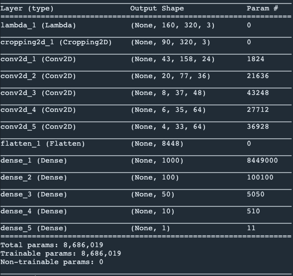
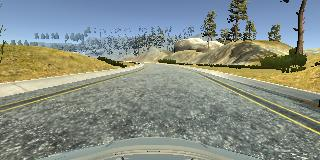
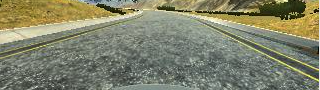
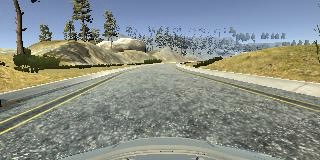

# **Behavioral Cloning** 

**Behavioral Cloning Project**

The goals / steps of this project are the following:
* Use the simulator to collect data of good driving behavior
* Build, a convolution neural network in Keras that predicts steering angles from images
* Train and validate the model with a training and validation set
* Test that the model successfully drives around track one without leaving the road
* Summarize the results with a written report

---

### Model Architecture and Training Strategy

#### 1. An appropriate model architecture has been employed

My model is samiliar with the network in the lesson ``Even More Powerful Network`` from NVIDIA, the architecture of my model is shown below. The network is build in (model.py lines 45-61)

#### 2. Attempts to reduce overfitting in the model

The model was trained and validated on different data sets to ensure that the model was not overfitting (code line 107-111). 

#### 3. Model parameter tuning

The model used an adam optimizer, so the learning rate was not tuned manually (model.py line 106).

#### 4. Appropriate training data

I used three dataset to train the network, one is the original `project3_data /data` given by udacity and the other two is I get from the simulator called `project3_data/road_1` and `project3_data/road_rev_1`. There are 14207 center images in these three folders in total. I split them into training set (11365 images) and valid set (2842 images).

---

### Overall Design Process in Behavioral Cloning Project

* I used the neural network samiliar with the network in the lesson ``Even More Powerful Network`` proposed by NVIDIA. The first layer is a Lambda layer to normalize the input image, then followed by a Cropping2D layer to crop the iamge for faster training. The result of this Cropping2D layer is shown below. The rest of the network are some convoluation layers and fully connected layers.

**Before Crop**

**After Crop**

* To do the data agumentation I flip the each images and angles and use the augmentated dataset to do training and validation. The data agumentation process is shown below:

**Before Agumentation**

**After Agumentation**

* Then I trained the network by using Keras build in adam optimizer and mean square error, I trained the network 5 epoaches to avoid overfitting.

* Finally I use the simulator to test the model `model.h5` and generate the video to visual which is `run1.mp4`

